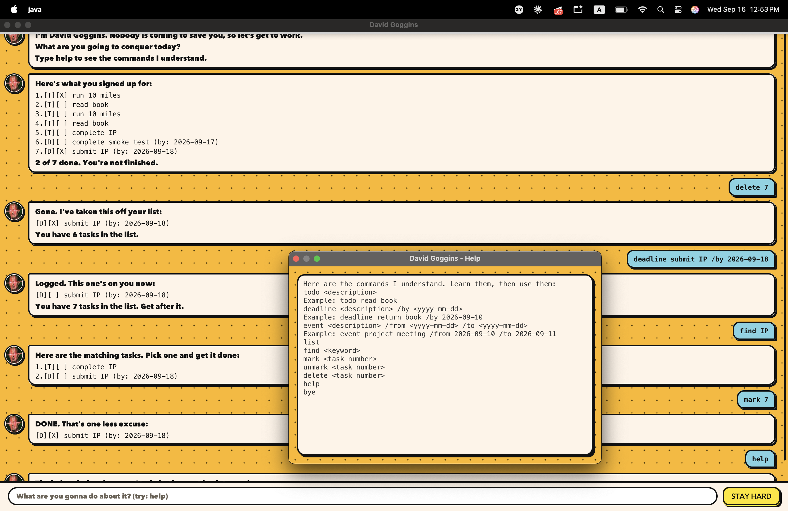

# David Goggins

David Goggins is a small JavaFX chatbot that keeps your to-dos, deadlines, and events, and refuses to let you hide behind any of them.

Talk to it in the GUI window, or from the command line. Tasks are saved to `data/tasks.txt`, so they are still there the next time you open it.



The full user guide is at [docs/README.md](docs/README.md).

## Quick start

1. Install Java 25.
2. Download `davidgoggins.jar` from the latest release.
3. Copy the JAR into an empty folder.
4. In a terminal, run `java -jar davidgoggins.jar`.
5. Type a command and press Enter, or click **STAY HARD**.
6. Type `help` to see the command list.
7. Type `bye` to exit.

You can also run from source with `./gradlew run`. The CLI entry point is `davidgoggins.DavidGoggins`.

Command words are case-insensitive (`LIST` works the same as `list`); descriptions keep the case you typed. Task numbers start at 1 (the first task in the current list).

## Add a to-do

`todo DESCRIPTION`

Example: `todo read book`

```
 Logged. This one's on you now:
   [T][ ] read book
 You have 1 task in the list. Get after it.
```

## Add a deadline

`deadline DESCRIPTION /by yyyy-mm-dd`

Example: `deadline return book /by 2026-09-10`

```
 Logged. This one's on you now:
   [D][ ] return book (by: 2026-09-10)
 You have 2 tasks in the list. Get after it.
```

Dates must be written as `yyyy-mm-dd`. Impossible dates such as `2026-02-30` are rejected, and `/by` may be used only once.

## Add an event

`event DESCRIPTION /from yyyy-mm-dd /to yyyy-mm-dd`

Example: `event project meeting /from 2026-09-10 /to 2026-09-11`

```
 Logged. This one's on you now:
   [E][ ] project meeting (from: 2026-09-10 to: 2026-09-11)
 You have 3 tasks in the list. Get after it.
```

`/from` must come before `/to`, and the end may not be earlier than the start. Each flag may be used only once.

## List tasks

`list`

Shows every saved task, numbered from 1, with a line on how far you have got.

```
 Here's what you signed up for:
 1.[T][X] read book
 2.[D][ ] return book (by: 2026-09-10)
 3.[E][ ] project meeting (from: 2026-09-10 to: 2026-09-11)
 1 of 3 done. You're not finished.
```

## Mark and unmark

`mark INDEX` marks that task as done.

`unmark INDEX` marks that task as not done.

Example: `mark 1`

```
 DONE. That's one less excuse:
   [T][X] read book
```

## Delete a task

`delete INDEX`

Removes that task and renumbers the ones after it.

Example: `delete 3`

```
 Gone. I've taken this off your list:
   [E][ ] project meeting (from: 2026-09-10 to: 2026-09-11)
 You have 2 tasks in the list.
```

## Find tasks

`find KEYWORD`

Shows tasks whose description contains KEYWORD (case-insensitive). The numbers in the result count the matches only, not the full list, so `mark 1` afterwards still means the first task in the whole list.

Example: `find book`

```
 Here are the matching tasks. Pick one and get it done:
 1.[T][X] read book
 2.[D][ ] return book (by: 2026-09-10)
```

## Help and exit

`help` prints the command guide.

In the app window, David Goggins replies `The help window is open. Study it, then get back to work.` and the guide opens in a separate **David Goggins - Help** window. You can keep typing while it is open, typing `help` again brings the same window to the front instead of opening another, and it closes when you close the main window or type `bye`.

`bye` closes David Goggins.

`list`, `help`, and `bye` do not take extra words.

## Saving

David Goggins writes the full list to `data/tasks.txt` after every add, mark, unmark, or delete. The path is relative to the folder you run from, and the `data` folder is created for you on the first save.

The file holds one task per line, with fields separated by `|`. The second field is `1` for a done task and `0` for one still outstanding:

```text
T | 1 | read book
D | 0 | return book | 2026-09-10
E | 0 | project meeting | 2026-09-10 | 2026-09-11
```

If the save file is missing, David Goggins starts with an empty list. If it cannot be read, he starts empty and says so rather than overwriting it. Unreadable lines are skipped, and he tells you how many he ignored.

## Common mistakes

Errors come back in a reddish bubble (GUI) or with a `NO EXCUSES!` prefix (CLI). Typical cases:

- An unknown command
- A missing description, `/by`, `/from`, or `/to`
- A flag used more than once, or a flag that does not belong to that command
- A date that is not written as `yyyy-mm-dd`, or one that looks real but is not, such as 30 February
- An event whose end comes before its start
- A task already in the list, added again
- A task number that is missing, zero, out of range, or not a number
- A `|` in a description, since that is what separates fields in the save file

## Command summary

```
todo DESCRIPTION
deadline DESCRIPTION /by yyyy-mm-dd
event DESCRIPTION /from yyyy-mm-dd /to yyyy-mm-dd
list
mark INDEX
unmark INDEX
delete INDEX
find KEYWORD
help
bye
```

## Setting up in IntelliJ

Prerequisites: JDK 25, and IntelliJ updated to a recent version.

1. Open IntelliJ (if you are not on the welcome screen, click `File` > `Close Project` first).
2. Open the project: click `Open`, select the project directory, click `OK`, and accept the defaults at any further prompts.
3. Configure the project to use **JDK 25** (not another version), as explained [here](https://www.jetbrains.com/help/idea/sdk.html#set-up-jdk). In the same dialog, set **Project language level** to `SDK default`.
4. Locate `src/main/java/davidgoggins/DavidGoggins.java`, right-click it, and choose `Run DavidGoggins.main()` (if the editor shows compile errors, try restarting the IDE). The banner and this greeting mean the setup is correct:

   ```
   I'm David Goggins. Nobody is coming to save you, so let's get to work.
   What are you going to conquer today?
   Type help to see the commands I understand.
   ```

   To run the GUI instead, use `./gradlew run`, whose entry point is `davidgoggins.Launcher`.

**Warning:** keep `src/main/java` as the root folder for Java files. Do not rename it or move Java files outside that path, since tools such as Gradle expect to find them there.

## Credits

The GUI started from the SE-EDU JavaFX tutorial used in CS2103T (Jeffry Lum and Damith C. Rajapakse). The command, storage, and Goggins behaviour were written for this iP.
